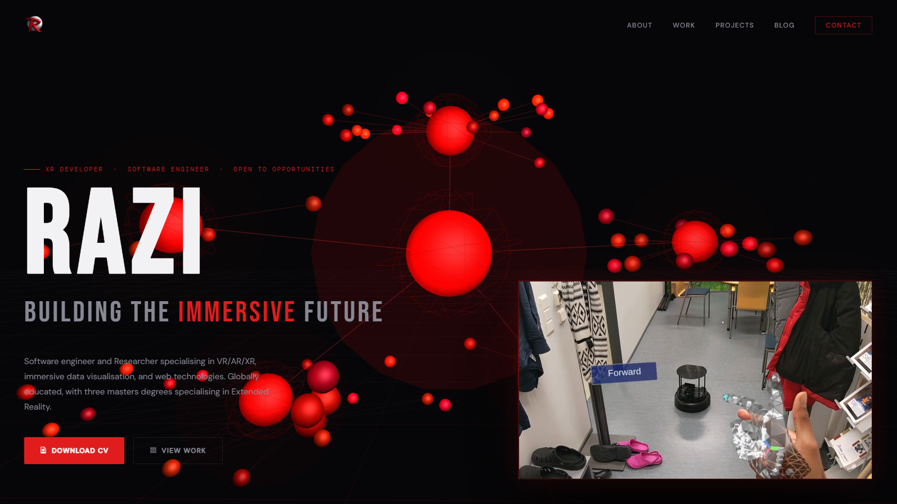

# Septian Razi | 3D Immersive Portfolio 🚀

Welcome to the repository for my personal portfolio—a high-performance, interactive 3D web experience designed to showcase my work in XR, Robotics, and Software Engineering.



## ✨ Overview

This website has been overhauled from a traditional static layout into an immersive **Spatial Portfolio**. It leverages modern web technologies to create a dynamic environment where projects are not just listed, but experienced through interactive 3D elements and cinematic showreels.

### Key Features
- **3D Hero Section**: An interactive Three.js environment featuring a "Spatial Showreel" and real-time WebGL graphics.
- **Holo-Monitor & Bento Sidebar**: A glassmorphic interface that cycles through flagship project highlights using cinematic video previews.
- **Structured Collections**: Organized content management using Jekyll Collections for `_projects`, `_work`, and `_blog`.
- **Performance Optimized**: Custom-built video controllers and lazy-loading systems to ensure smooth 60FPS interactions.
- **Fully Responsive**: A "mobile-first" 3D approach that dynamically adjusts camera positions and UI scaling for all devices.

## 🛠️ Tech Stack

- **Core**: [Jekyll](https://jekyllrb.com/) (Static Site Generator)
- **3D Engine**: [Three.js](https://threejs.org/)
- **Animations**: [GSAP](https://greensock.com/gsap/) (GreenSock Animation Platform)
- **Styling**: Vanilla CSS / Sass
- **Deployment**: [GitHub Pages](https://pages.github.com/)

## 🚀 Getting Started

To run this project locally, ensure you have Ruby and Jekyll installed on your machine.

1. **Clone the repository:**
   ```bash
   git clone https://github.com/septianrazi/septianrazi.github.io.git
   ```

2. **Install dependencies:**
   ```bash
   bundle install
   ```

3. **Serve the site:**
   ```bash
   bundle exec jekyll serve
   ```
   Open `http://localhost:4000` in your browser.

## 📂 Directory Structure

- `collections/`: Contains the markdown files for Projects, Work, and Blog posts.
- `assets/js/`: Logic for Three.js (`hero.js`) and UI animations (`animations.js`).
- `assets/videos/`: High-definition project highlights used in the 3D showreel.
- `_layouts/` & `_includes/`: Modular Liquid templates for site structure.

## 📬 Contact & Socials

- **Website**: [septianrazi.github.io](https://septianrazi.github.io)
- **LinkedIn**: [linkedin.com/in/septianrazi](https://linkedin.com/in/septianrazi/)
- **Email**: [raziseptian@gmail.com](mailto:raziseptian@gmail.com)

---
*Built with ❤️ by Septian Razi*
