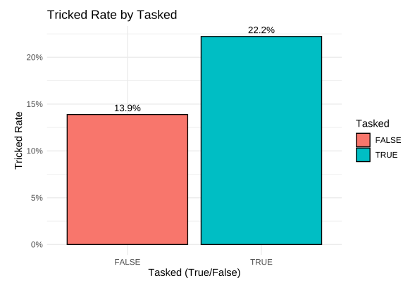
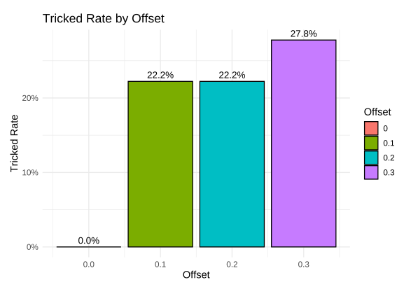

This post is an excerpt of my experiment and research at Toyohashi University of Technology, Japan.

## Background

Immersive virtual reality (IVR) technologies, such as augmented reality (AR), virtual reality (VR), and mixed reality (MR), are considered the building blocks of modern digital experiences. Currently, some field has already introduced the technologies such as entertainment, education, academic study, and shows the utility effect as powerful tools for knowledge and skill acquisition[9], [10]. This popularization, especially VR, is supported by technical progress such as hardware upgrade, standardized API support, and technical advancement of rendering[11]. In the progresses, developing locomotion is considered one of the most basic interaction activities and vital to VR since it allows the user to explore the virtual space[12]. Therefore, many locomotion techniques, for HMD-based VR, has been developed including teleportation[13], walking-in-place[14], and real walking [15], [16], [17], [18]. The real walking technique is particularly beneficial to enhance the sense of presence and improve the spatial knowledge, although these locomotion approach are effective[12]. However, the size of explored virtual space is restricted by the size of the tracking area in the actual world. This limitation remains a considerable challenge to realizing real walking in virtual spaces with different sizes when the user is tracked within a confined physical space.

The Redirected Walking (RDW) is a technique which enables users to walk naturally in an unlimited virtual space within a limited tracking area by rotating the virtual science view[12], [19], [20]. The approach was realized by Razzaque et al. in their early work[21]. With this approach, some subtle deviations are added between the user's virtual and physical movement, causing the user to move on a virtual path that differs from the physical walking path. A large virtual space can be explored by real walking within a small physical space in this manner. Although it is possible to realize RDW by applying a single type of redirection manipulation, the adoption of single redirection manipulation could be inflexible for different virtual space conditions and less effective for guiding the user. Therefore, various redirection controller methods that properly combine different types of redirection manipulations have been proposed in many works[12]. Here, the important things are what kind of redirection manipulations are effective.

Spatial disorientation, which is similar theoretical background with RDW, is achieved through three major sensory sources: visual, vestibular, and proprioceptive[22]. To achieve appropriate orientation the body relies on accurate perception and cognitive integration of all three systems. If visual, vestibular, and proprioceptive stimuli vary in magnitude, direction and frequency the resulting effect can be spatial disorientation. The human eye provides visual and spatial orientation, which is responsible for providing about 80% of the sensory inputs needed to maintain orientation. The vestibular system within the inner ear contributes 15%. Proprioceptive sensory inputs from receptors located in the skin, muscle, tendons, and joints account for 5% of the sensory information used to establish orientation[22]. Complex coordination between these sensory inputs is then translated and interpreted by the brain[22]. Thus, misinterpretation or inaccuracy of these three sources of information can lead to sensory mismatch, resulting in a variety of visual or vestibular illusions.

According to the study of navigation behaviors shows people encode the features of an environment for many fundamental everyday behaviors, including simple orientation in a space, route learning, map reading, and giving directions to other people[23]. And the navigation works on the VR environment are affected by the physical body movement[23]. Moreover, higher cognitive load decreases peripheral processing of task-irrelevant information—which decreases distractibility—as a side effect of the increased activity in a focused-attention network[24]. From these insight, we thought relatively high load task has possibility to make a human have disorientation under the visual gap manipulation, like RDW.

Our project investigates how our brain handles a gap between real and visual world. This project experiment aims to comprehend how distraction task affects a perception of an orientation to combine with the angular offset with which is the rotation has angle offset between actual and virtual world and whether the task enhances a spatial disorientation. The project intends to find a factor to facilitate a restriction of the 3D virtual environment of which is impossible unlimited movement with physical body.

## Research Question

- What is the thresholds at which the angle offset becomes noticable?
- Does increased mental load allow for higher angle offsets to be in place before it becomes noticable?

## Methodology

To accurately answer our research question, we first set up conditions and tasks to investigate ways to misdirect users within a virtual environment. Due to the time and resource constraints at hand during the class, we had chosen to investigate the ways human perceive rotations.

Our methodology relied on two independant variables, the amount of rotational distortion, the task complexity. The dependant variable is whether participants were deceived into thinking a normal rotation occured.

### Stimuli

The two independant variables are those we are seeking to alter to investigate the results onto the dependant variable. As such, our conditions involve altering on one hand, the rotational distortion, but on the other hand, the task complexity. These are the two stimulii we apply in our experiment.

**Rotational Distortion** Rotational distortion is altering a users current rotation without their direct control. Multiple different studies have observed ways to obscure "rotation" or introduce rotational distortion. The two main approaches are perception manipulation and virtual space manipulation [2]. Tamura et al. used a perception manipulation approach in their face recognition behind the observer experiment that amplified the rotation of the head when turning one side or the other [25]. Other studies add discrete shifts in the virtual environment when a user is distracted, such as when a user is facing downwards, otherwise known as change blindness [26]. This allows this shift to be undetected and deceive the user. In contrast, some studies include gradual shifts that are so subtle in the environment that it is so difficult to detect. Our approach, similarly, involves changing the virtual space subtly.

To accomplish this, we subtly change the rotation of the room (and all its contents) a user is situated in. We physically alter the rotation of the room along the y-axis based on the current rotation of the user's viewpoint along the y-axis. We use the following formula:

<p style="font-family: serif; font-size: 1.1em;">
  R<sub>y</sub> = V<sub>y</sub> × off + (loop × 360 × off)
</p>

where:

<ul>
  <li><strong>R<sub>y</sub></strong>: Resulting room rotation on the y-axis</li>
  <li><strong>V<sub>y</sub></strong>: Current viewpoint rotation on the y-axis</li>
  <li><strong>off</strong>: Offset constant determining the strength of rotation</li>
  <li><strong>loop</strong>: Counter for full rotations conducted by the user</li>
</ul>

The offset is constant that multiplies against the current viewpoint rotation value. It determines the strength or "subtlety" of the rooms rotation in reaction to the current users viewpoint. A value of 0 would mean that the room does not rotate and does not try to deceive the user. Higher values would mean to rotate aroudn the entire virtual room, the user would have to conduct a larger than 360 rotation in the real world. A value of 1 would mean that the room would follow the viewpoint tightly, which results in the user facing forward in the room no matter how much rotation they perform. The right hand part of the equation under the brackets simply handle for edge cases where a user viewpoints can jump from 360 to 0 when the complete a rotation (or the other way around as well), allowing for seamless rotation of the room.

After initial pilot studies and testing internally, we found that an offset of around 0.2 to 0.3 was the threshold at which it because trivially easy to detect an abnormality with the environment. As such, testing a offsets beyond 0.3 may not be informationally useful. Therefore, we trial 4 levels of stimuli regarding rotational offset, no rotational distortion (offset = 0.0), low rotational distortion (offset = 0.1), medium rotational distortion (offset = 0.2), high rotational distortion (offset = 0.3).

**Task Complexity** Another variable to measure includes task complexity. Previous studies have showed that mental load can allow users to be more susceptible to deception [27]. In the context of virtual reality, many studies on redirected walking or manipulation have shown a higher mental load can help users immerse themselves into the virtual environment more effectively, foregoing real-world anchors and perception. As such, we design two different tasks that encourage exploration via simple rotation, but also two different levels of induced mental load.

The simplest task, involves that of simply searching for green spheres around the room. These spheres, when interacted with, will disapear and a subsequent sphere around the room will be spawned in either the north, east, south or west part of the room randomly. Repeating this multiple times encapsulates the task required for the simpler mental load stimuli.

As such, we have devised the following 8 condition sets our participants will be involved in:

<!--
| Task Complexity | Rotation Offset |
| --------------- | --------------- |
| Simple          | 0.0             |
| Simple          | 0.1             |
| Simple          | 0.2             |
| Simple          | 0.3             |
| Complex         | 0.0             |
| Complex         | 0.1             |
| Complex         | 0.2             |
| Complex         | 0.3             | -->

<table style="border-collapse: collapse; width: 100%;">
  <thead>
    <tr>
      <th style="border-bottom: 1px solid #ccc; text-align: left; padding: 6px;">Task Complexity</th>
      <th style="border-bottom: 1px solid #ccc; text-align: left; padding: 6px;">Rotation Offset</th>
    </tr>
  </thead>
  <tbody>
    <tr><td style="padding: 6px;">Simple</td><td style="padding: 6px;">0.0</td></tr>
    <tr><td style="padding: 6px;">Simple</td><td style="padding: 6px;">0.1</td></tr>
    <tr><td style="padding: 6px;">Simple</td><td style="padding: 6px;">0.2</td></tr>
    <tr><td style="padding: 6px;">Simple</td><td style="padding: 6px;">0.3</td></tr>
    <tr><td style="padding: 6px;">Complex</td><td style="padding: 6px;">0.0</td></tr>
    <tr><td style="padding: 6px;">Complex</td><td style="padding: 6px;">0.1</td></tr>
    <tr><td style="padding: 6px;">Complex</td><td style="padding: 6px;">0.2</td></tr>
    <tr><td style="padding: 6px;">Complex</td><td style="padding: 6px;">0.3</td></tr>
  </tbody>
</table>

The complex task is a basic memory game. Similar to the simple task, green spheres are spawned in the room randomly. However, once interacted with, a set of 7 cubes around the room with different colours are spawned. To complete the task, the user needs to interact with the cubes in a specified order according to their colour. A sequence of colours to select from start to finish are shown in the beginning, but disappear once the first cube is interacted with. As such, users need to now interact with the other 6 cubes in the correct order they have memorised to complete the task. This task involves both memory and exploration. This complex task invokes a higher mental load which is the aim of this stimuli.


_Figure: Bird eyes view of the room. The circular mat in the centre indicates the user's fixed location._

### Software Design

The software developed was using Unity and utilises the Microsoft Mixed Reality Toolkit (MRTK) library. Using unity, we developed a simple virtual environment based on a hotel room. This represented the virtual room that we would deceivingly distort to the user. The MRTK library was a simple library that helped program simple interactables and virtual reality specific code [28]. It also provided a plethora of useful UI elements to help with our development.

Our software consisted of interactable virtual environments that realise the tasks mentioned in the methodology. One key part of the software also allowed for some level of automation from the software for the experiment setup. This included allowing our conditions to be automatically loaded into a participants activity from the available conditions. The conditions were stored in a dictionary data structure such that it could be appended to other dictionaries and written conveniently to a CSV file. The code below shows how our code performs the virtual space manipulation. The script is attached to the parent object of the entire room such that it's rotation changes based on the current participants viewpoint angle (or head rotation).

```csharp
// Change the rotation of the room based on the current headrotation.
void Update()
{
    float yrotSource = (float) PublishHeadRotation.Instance.yrot; // get current head rotation
    if (prevYrot - yrotSource > 330)
    {
        headLoopCount++;
    } else if (prevYrot - yrotSource < -300)
    {
        headLoopCount--;
    }
    prevYrot = yrotSource;
    Vector3 targetRotation = this.transform.eulerAngles;
    targetRotation.y = yrotSource * offset + (headLoopCount * 360 * offset); // change the y rotation
    this.transform.eulerAngles = targetRotation;
    Debug.Log("offsetRot*" + targetRotation.y + " headLoopCount*" + headLoopCount);
}
```


_Figure: Green spheres as shown will spawn throughout the room randomly one-by-one._

Our software app also provides an automated data capture system regarding useful variables throughout the experiment. This data includes the conditions/stimuli used, the measured dependent variable result "tricked", and additional data such as timing of tasks. This data is stored in a dictionary data structure which is continuously updated throughout the process of the experiment. After each participant has completed the experiment, is then converted into a CSV for future data analysis purposes.

## Experiment Setup

**Participants** We included a total of 7 participants, chosen from other students in this XR Case study class. 4 of the participants were Japanese, while the other 3 were from different backgrounds. 1 participant was female and 6 were male all ranging in ages between 20 - 27 years. All partipants had normal to corrected vision and were not made aware of the goal or objective of the experiment as to not bias results. All participants were made aware of their rights and obligations regarding their data and participation and provided written consent approved by the Ethics Committee for the purpose of this XR Case study class.

**Tutorial** Before the experiment begins, we present the user a simple tutorial environment. Firstly, we allow the user to place and adjust the virtual reality headset, alongside an eye cover mask for not only hygience, but helps enhance immersion in the virtual world by preventing peeking by looking downwords through the gap between the headset and face. We also have the user to sit on a fully pivoting chair, to help with their rotational tasks. We position them in a fixed location that is reachable to a keyboard within hands distance. This keyboard is relevant to determining the result of our dependent variable.

We then commence the tutorial environment programmed in Unity. This tutorial environment allows the user to familiarise themselves with the controls required for the experiment, such as using the controller and moving around. It also helps users understand what is required of them during the different tasks in the experiment. This practice trial helps minimises the learning effect [29].

**Experiment Procedure** Upon completion of the tutorial, we commence the main experiment tasks. The main experiment consists of the aforementioned 8 experiment conditions. To prevent learning effects, and other biases towards the order of conditions, we randomise which condition the participant experiences [29]. While the participants complete their task in the virtual environment, one of our research team members would be responsible for the logistics of the experiment while the another is responsible for measuring the "tricked" dependent variable and the software.

As the user completes all the tasks within a condition, to measure our dependent variable, "tricked", we have the user click on a keyboard which physically is aligned to the front and the beginning of where they commenced the task (before the offset was in place). This keyboard is within arms distance and all buttons trigger a response. As such, no precision is required when clicking on the keyboard, and can be treated as if it is a giant button. If the offset was succesfull, the partipant should see in the virtual world they are facing their original forward position, but in the real world, they are facing a slightly ajar direction. If they attempt to click on the keyboard yet feel no response, we then ask the participant to pause in the direction and query them verbally if they felt that any sort of trickery or distortion during the condition. If they answer no, they we deem the participant tricked. If not, we deem the participant not tricked.


_Figure: 7 Cubes of different colours will spawn around the room. Interacting with them in order of the memory prompt is required to complete the task._


_Figure: Experiment with participants._


_Figure: Setup of the experiment. Participant is in a fixed position with a keyboard in close proximity. Experiment software is being run on the PC._

Once the user completes all of the assigned conditions, the experiment is complete and a CSV file is generated. This CSV file will be stored for analysis and future reference.

## Analysis

The dataset provides information about the experiment conducted to study sensory feedback manipulation in Virtual Reality (VR), focusing on rotational awareness. Each column represents a key aspect of the participants' interactions in the VR environment. Below is a detailed description of each column:

- **condition_time** (numeric): Represents the total time participants spent in the VR environment during the experiment. Example values include 142.23 and 68.11.
- **task_times** (string): A series of space-separated times indicating the duration for completing individual tasks. Most participants performed 10 normal tasks and 3 color memory tasks. Example values are "0 71.87 0 70.34 0.007" and "0 30.93 0 37.17 0.003".
- **tricked** (logical: TRUE/FALSE): Indicates whether the participant was "tricked" by the VR manipulation. Example values: TRUE, FALSE.
- **angle_diff** (numeric): The difference in angles (in degrees) between real-world and virtual-world rotations when participants were tricked or not tricked. Higher values indicate greater misalignment. Example values: 9.24 and 355.85.
- **offset** (numeric): The multiplication factor applied to virtual environment rotated to create a mismatch between real and virtual rotations. Possible values: 0, 0.1, 0.2, 0.3. For instance, 0.2 indicates that 20% of the virtual environmental rotated.
- **tasked** (logical: TRUE/FALSE): Indicates whether participants were performing tasks (TRUE) or not (FALSE). Example values: TRUE, FALSE.
- **pID** (numeric): A unique identifier for each participant. Example values: 5601, 5602.

In the first step of data analysis, data from multiple files is merged into a single file for further analysis.

```r
# List and combine CSV files matching the pattern
file_list <- list.files(pattern = "experimentdata\\.csv")
# Read and combine files
combined_data <- do.call(rbind, lapply(file_list, read.csv))
write.csv(combined_data, "combined_data.csv", row.names = FALSE)
# Load combined data
data <- read_csv("combined_data.csv",show_col_types = FALSE)
data <- data[, -ncol(data)] # Drop the last column
write.csv(data, "combined_data.csv", row.names = FALSE)
data <- read.csv("combined_data.csv")
# Ensure 'offset' is numeric and 'tricked' is logical
data$offset <- as.numeric(data$offset)
data$tricked <- as.logical(data$tricked)
```

In this analysis, the primary hypothesis is that people are more likely to be tricked when there is cognitive load in the form of tasks in a virtual reality (VR) environment, compared to when no tasks are performed. In this section, I focused on grounding and normalizing the count of participants who were tricked. I then plotted the tricked rate against the total number of tasks performed, comparing scenarios with cognitive load (tasks) versus without cognitive load (no tasks).

```r
# normalized the data for tricked rate
data_tricked_rate <- data %>%
  group_by(tasked) %>%
  summarise(
    total_count = n(),
    tricked_true_count = sum(tricked, na.rm = TRUE),
    tricked_rate = tricked_true_count / total_count
  )
# Plot tricked rate
ggplot(data_tricked_rate, aes(x = tasked, y = tricked_rate, fill = tasked)) +
  geom_bar(stat = "identity", color = "black") +
  labs(
    title = "Tricked Rate by Tasked",
    x = "Tasked (True/False)",
    y = "Tricked Rate",
    fill = "Tasked"
  ) +
  scale_y_continuous(labels = scales::percent) +
  theme_minimal() +
  theme(text = element_text(size = 12)) +
  geom_text(aes(label = scales::percent(tricked_rate)), vjust = -0.5)
```


The plot clearly shows that the tricked rate is higher when participants were engaged in tasks within the VR environment, as indicated by a tricked rate of 22.2% with cognitive load (tasks), compared to 13.9% when no tasks were performed. This supports the hypothesis that cognitive load increases susceptibility to being tricked in the VR environment, potentially due to the additional mental effort required to complete tasks while navigating the virtual space.

The next hypothesis aimed to explore the influence of virtual environment rotation on participants' susceptibility to being tricked. Specifically, we sought to understand how varying levels of rotation in the virtual environment, manipulated through the 'offset' parameter, affected the likelihood of participants experiencing a mismatch between their real-world and virtual-world orientations. By comparing participants' responses under different rotation conditions, we hypothesized that increasing the rotation offset would lead to higher rates of being tricked, as the discrepancy between real and virtual movements would become more pronounced.

```r
# Calculate Tricked Rate by Offset
data_tricked_by_offset <- data %>%
  group_by(offset) %>%
  summarise(
    total_count = n(),
    tricked_true_count = sum(tricked, na.rm = TRUE),
    tricked_rate = tricked_true_count / total_count
  )
# Plot Tricked Rate by Offset
ggplot(data_tricked_by_offset, aes(x = offset, y = tricked_rate, fill = as.factor(offset))) +
  geom_bar(stat = "identity", color = "black") +
  labs(
    title = "Tricked Rate by Offset",
    x = "Offset",
    y = "Tricked Rate",
    fill = "Offset"
  ) +
  scale_y_continuous(labels = scales::percent) +
  theme_minimal() +
  theme(text = element_text(size = 12)) +
  geom_text(aes(label = scales::percent(tricked_rate)), vjust = -0.5)
```


In the plot, we observe that with no rotation (offset of 0) or zero rotation, there were no instances of participants being tricked. However, when the offset increased to 0.1 and 0.2, the tricked rate rose to approximately 22% of the time. This rate continued to increase, reaching 27.8% at an offset of 0.3. This suggests that the rotation step from 0.1 to 0.2 had no significant effect on the tricked rate, while a noticeable increase in the tricked rate occurred when the offset reached 0.3.

The results indicate that smaller rotational discrepancies (at 0.1 and 0.2 offsets) may not be enough to create a strong perceptual misalignment for participants, as their sensory system may have been able to compensate for the minor difference. However, when the offset increased to 0.3, the larger rotation caused a perceptual mismatch that participants could no longer ignore, leading to a higher tricked rate. This suggests that the virtual environment's rotation step plays a significant role in influencing participants' awareness and their susceptibility to being tricked by the system. It may also indicate that there is a threshold of rotational misalignment at which the cognitive load and perceptual discrepancies become more pronounced, making participants more likely to experience a sense of disorientation or confusion.

To assess the strength of the relationship between whether participants are tasked and whether they are tricked, we can apply the Chi-squared test for independence. This statistical test evaluates whether there is a significant association between two categorical variables—in this case, "tasked" (whether the participant is performing a task) and "tricked" (whether the participant was affected by the VR manipulation).

The Chi-squared test compares the observed frequencies of occurrences (i.e., the number of participants who were tasked and tricked, tasked but not tricked, and so on) to the expected frequencies, which would occur if there were no relationship between the two variables. A significant p-value (typically less than 0.05) would indicate that the two variables are not independent, suggesting that the presence of a task influences whether or not a participant is tricked by the VR manipulation.

```r
# Create a contingency table for 'tasked' and 'tricked'
table_tasked_tricked <- table(data$tasked, data$tricked)
# Perform the Chi-square test for independence
chi_square_result <- chisq.test(table_tasked_tricked)
# Print the p-value from the Chi-square test result
p_value <- chi_square_result$p.value
# Display the p-value
cat("The p-value from the Chi-squared test is:", p_value)
## The p-value from the Chi-squared test is: 0.54
```

The p-value from the Chi-squared test is 0.54, indicating that there is no statistically significant relationship between being tasked and being tricked. This result suggests that the data does not provide strong evidence of an association between cognitive load (introduced through tasks) and the likelihood of participants being tricked by the virtual environment.

However, an observable trend is present in the percentages: 22.2% of participants were tricked when tasked, compared to only 13.9% when not tasked. While this difference is notable, it does not reach statistical significance, potentially due to the limited sample size or other biases within the experiment. For example, the number of participants may not be sufficient to detect a small or moderate effect, or there could be confounding factors influencing the results, such as individual differences in cognitive abilities, familiarity with VR, or environmental conditions during the tasks.

These findings highlight the importance of considering experimental limitations when interpreting the results. A larger participant pool and a more controlled experimental setup could help to validate the observed trend and provide more definitive insights into the relationship between tasks and tricking susceptibility in VR environments.

## Conclusion

In conclusion, our results were not able to find statistically significant results. This is most likely due to the simplified nature of our experiment setup. We only performed our experiment on 7 participants, of which most only performed one condition each. As such, it is unlikely, that with the amount of datapoints generated, we were able to find a statistically sound observation. However, this finding does seem to show a trend in which the high mental load tasked stimulii resulted in much more "tricked" responses. Therefore, it may be worth exploring different types of mental load tasks in the future to better deceive users.

So, to answer our research question, an angle offset of beyond 0.3 is still unnoticeable for some participants. However, increased mental loads do indeed allow for higher offset angles to be placed before it becomes noticable.

## Limitations and Future Work

One of the key limitations with this project was the simplified experiment aparatuses. Besides a PC and VR headset, we had to make do with our small and crowded classroom to conduct the experiment. The VR headset provided was not really suited for repeated rotations due to the cable that would always tangle. This was inconvenient and had to be managed by our team.

An aspect that we realise may have kept users real-world awareness in tact in some conditions is noise being generated from specific points in the classroom. For example, when rotating around you can hear one classmate group to our right talk. Using our sound localisation skills provided by our ears, it may give away your real-world rotation at any given time, ruining the chance of the "tricked" response.

An interesting addendum or addition to our work would be a more rigourous study in finding the exact rotational distortion offset threshold which was not achieved fully in our experiment. An adjustable stimulii or limitation stimulii method of study may be promising in that regard. Furthermore, if given more resources and time, a more advanced experiment aparatus would have allowed us to explore our research question more effectively.

However, our work showcases the possibilities in future work regarding redirected walking and virtual reality sensory manipulation. We have shown that VR is indeed a viable tool of immersion. Our work highlights how even in limited spaces and constraints, there are ways to programmatically manipulate the environment such that a desired action, even if impossible to do in the real world, can be accomplished in the virtual. Our research opens the gates to new ways of exploiting our senses, a research area that may be ever growing as virtual reality democratises around the world.

---

## References

[1] B. de Gelder, J. Kätsyri, and A. W. de Borst, "Virtual reality and the new psychophysics," _British Journal of Psychology_, vol. 109, pp. 421–426, May 2018, doi: 10.1111/bjop.12308.

[2] L. Fan, H. Li, and M. Shi, "Redirected walking for exploring immersive virtual spaces with HMD: A comprehensive review and recent advances," _IEEE Transactions on Visualization and Computer Graphics_, vol. 29, pp. 4104–4123, May 2022, doi: 10.1109/tvcg.2022.3179269.

[3] P. Ekman, "Facial expression and emotion." _American Psychologist_, vol. 48, pp. 384–392, 1993, doi: 10.1037/0003-066x.48.4.384.

[4] D. Gill, O. G. B. Garrod, R. E. Jack, and P. G. Schyns, "Facial movements strategically camouflage involuntary social signals of face morphology," _Psychological Science_, vol. 25, pp. 1079–1086, Mar. 2014, doi: 10.1177/0956797614522274.

[5] A. C. Little and D. I. Perrett, "Using composite images to assess accuracy in personality attribution to faces," _British Journal of Psychology_, vol. 98, pp. 111–126, Feb. 2007, doi: 10.1348/000712606x109648.

[6] K. Dion, E. Berscheid, and E. Walster, "What is beautiful is good," _Journal of Personality and Social Psychology_, vol. 24, pp. 285–290, 1972, doi: 10.1037/h0033731.

[7] J. F. Stins, K. Roelofs, J. Villan, K. Kooijman, M. A. Hagenaars, and P. J. Beek, "Walk to me when i smile, step back when i'm angry: Emotional faces modulate whole-body approach–avoidance behaviors," _Experimental Brain Research_, vol. 212, pp. 603–611, Jun. 2011, doi: 10.1007/s00221-011-2767-z.

[8] E. G. Krumhuber, L. Tamarit, E. B. Roesch, and K. R. Scherer, "FACSGen 2.0 animation software: Generating three-dimensional FACS-valid facial expressions for emotion research." _Emotion_, vol. 12, pp. 351–363, 2012, doi: 10.1037/a0026632.

[9] N. Partarakis and X. Zabulis, "A review of immersive technologies, knowledge representation, and AI for human-centered digital experiences," _Electronics_, vol. 13, no. 2, 2024, doi: 10.3390/electronics13020269.

[10] M. A. Mohsen and T. S. Alangari, "Analyzing two decades of immersive technology research in education: Trends, clusters, and future directions," _Education and Information Technologies_, vol. 29, no. 3, pp. 3571–3587, 2024.

[11] T. Hilfert and M. König, "Low-cost virtual reality environment for engineering and construction," _Visualization in Engineering_, vol. 4, Jan. 2016, doi: 10.1186/s40327-015-0031-5.

[12] L. Fan, H. Li, and M. Shi, "Redirected walking for exploring immersive virtual spaces with HMD: A comprehensive review and recent advances," _IEEE Transactions on Visualization and Computer Graphics_, vol. 29, pp. 4104–4123, Oct. 2023, doi: 10.1109/TVCG.2022.3179269.

[13] E. Bozgeyikli, A. Raij, S. Katkoori, and R. Dubey, "Point & teleport locomotion technique for virtual reality," _Proceedings of the 2016 Annual Symposium on Computer-Human Interaction in Play - CHI PLAY '16_, 2016, doi: 10.1145/2967934.2968105.

[14] N. C. Nilsson, S. Serafin, and R. Nordahl, "Walking in place through virtual worlds," _Lecture notes in computer science_, pp. 37–48, Jan. 2016, doi: 10.1007/978-3-319-39516-6_4.

[15] W. Gai et al., "Supporting easy physical-to-virtual creation of mobile VR maze games," May 2017, doi: 10.1145/3025453.3025494.

[16] N. Nitzsche, U. D. Hanebeck, and G. Schmidt, "Motion compression for telepresent walking in large-scale remote environments," _Proceedings of SPIE_, vol. 5079, pp. 265–265, Sep. 2003, doi: 10.1117/12.488379.

[17] Z.-C. Dong, X.-M. Fu, C. Zhang, K. Wu, and L. Liu, "Smooth assembled mappings for large-scale real walking," _ACM Transactions on Graphics_, vol. 36, pp. 1–13, Nov. 2017, doi: 10.1145/3130800.3130893.

[18] Q. Sun et al., "Towards virtual reality infinite walking," _ACM Transactions on Graphics_, vol. 37, pp. 1–13, Aug. 2018, doi: 10.1145/3197517.3201294.

[19] J. Lee, S. Hwang, A. Ataya, and S. J. Kim, "Effect of optical flow and user VR familiarity on curvature gain thresholds for redirected walking," _Virtual Reality_, vol. 28, pp. 1–15, Mar. 2024, doi: 10.1007/S10055-023-00935-4/FIGURES/7.

[20] F. Steinicke, G. Bruder, J. Jerald, H. Frenz, and M. Lappe, "Estimation of detection thresholds for redirected walking techniques," _IEEE Transactions on Visualization and Computer Graphics_, vol. 16, pp. 17–27, Jan. 2010, doi: 10.1109/TVCG.2009.62.

[21] Z. K. S. Razzaque and M. Whitton, "Redirected walking," 2001.

[22] R. K. Meeks and P. M. Bell, "Aerospace, physiology of spatial orientation," Dec. 2018, Available: https://www.ncbi.nlm.nih.gov/books/NBK518976/

[23] A. D. Smith, "Virtual reality and spatial cognition: Bridging the epistemic gap between laboratory and real-world insights," _Science & Education_, Feb. 2024, doi: 10.1007/s11191-024-00505-3.

[24] P. Sörqvist, Ö. Dahlström, T. Karlsson, and J. Rönnberg, "Concentration: The neural underpinnings of how cognitive load shields against distraction," _Frontiers in Human Neuroscience_, vol. 10, May 2016, doi: 10.3389/fnhum.2016.00221.

[25] H. Tamura, Y. Kobayashi, S. Nakauchi, and T. Minami, "Spatial modulation of facial expression: Enhanced recognition of faces behind the observer," _bioRxiv (Cold Spring Harbor Laboratory)_, May 2024, doi: 10.1101/2024.05.08.593080.

[26] D. J. Simons and R. A. Rensink, "Change blindness: Past, present, and future," _Trends in Cognitive Sciences_, vol. 9, pp. 16–20, Jan. 2005, doi: 10.1016/j.tics.2004.11.006.

[27] T. C. Peck, H. Fuchs, and M. C. Whitton, "Evaluation of reorientation techniques and distractors for walking in large virtual environments," _IEEE Transactions on Visualization and Computer Graphics_, vol. 15, pp. 383–394, May 2009, doi: 10.1109/tvcg.2008.191.

[28] Microsoft, "MRTK2-unity developer documentation - MRTK 2." Microsoft.com, Dec. 2022. Accessed: Nov. 21, 2024. [Online]. Available: https://learn.microsoft.com/en-au/windows/mixed-reality/mrtk-unity/mrtk2/?view=mrtkunity-2022-05

[29] D. C. Montgomery, _Design and analysis of experiments_. John Wiley & Sons, 2013.
