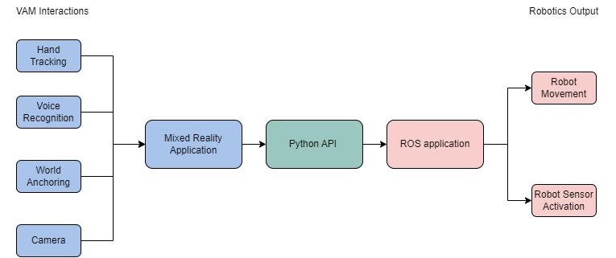
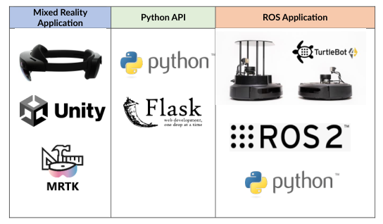

## Background

Human robot interaction (HRI) is a key research area with growing demand and interest, especially in the wake of new interface devices beyond a traditional computer or controller. One such promising interface device, is virtual, augmented, and mixed reality headsets (VAM). The combination of these two fields is known as VAM-HRI, a growing research field aiming to provide more novel and intuitive HRI systems (Walker et al., 2023). Many different works have explored the use of this technology with different combinations of VAM headsets and Robots, including Mobile AR (Hashimoto et al., 2012), Commercial VR headsets (Zaid Gharaybeh, H.J. Chizeck and Stewart, 2019).

There have been many examples of work using HoloLens 2 and Robotics (Xue et al., 2020) (Nico Vom Hofe et al., 2023), all proposing different interaction techniques. As such, it would be interesting to unify these different interactions into one singular HoloLens 2 Application. Furthermore, many of these projects are aimed at a specific type of robot to operate. Indeed, there are countless robots available that will have different navigation, movement, and sensor mechanisms (Chen et al., 2020). Therefore, it will be useful to generalise these interactions techniques such that it is applicable on different robots. Due to the novelty of the project, and the need for a unifying system that combines multiple VAM-HRI interaction techniques and robots, we propose this project.

## Design Proposal

We propose a system that utilises the novel and unique interaction methods provided by the HoloLens 2 and translate it in an intuitive way to control a robot via ROS2, inspired by the interaction techniques from previous works. We will aim to develop not just software and code, but a whole system in itself that can be reusable for other XR platforms and any other robot using ROS2 that is modularizable.

## Goals

We have the following goals to achieve with our development, which we deem as the minimum viable product for our command.

1. Create a system to communicate between the HoloLens 2 and a ROS2 Robot
2. Create a HoloLens 2 App that translates an interaction into a command, which include these basic interactions:
   - Holographic Button Commands
   - Voice Commands
   - Custom Gestures
3. Create a ROS2 Package node that can receive a command, and translate it to a robot output, namely at least:
   - Moving the robot forward
   - Moving the robot sideways
   - Stopping movement

### Stretch Goals

Furthermore, we also outline several stretch goals that can be pursued given enough resources and time. We note that these features are considered quite complex to develop for and may not be prioritised in our development timeline. The features are ordered by increasing complexity.

1. Add new novel interaction technique from the HoloLens.
2. Integrate functionality to work with another robot such as the robot arm.
3. Create a way to synchronise the spatial anchors between HoloLens2 and the Robot World Space
4. Once spatial anchors can be synchronised, we can try new Interaction techniques from the HoloLens2 including:
   - Spatial Point click as Robot Movement Target
   - Eye tracking based commands based on whether the user is looking at or away from the robot.
   - Webcam + Computer Vision based commands that can inform the robot of obstacles or targets.

## Technical Plan

### Architecture

Our plan is to create a system bridging VAM Interactions on one end and Robotics Output on the other, with a Mixed Reality Application feeding into a Python API, which in turn feeds into a ROS application. Of particular importance is the bridge in the middle connecting the Mixed Reality application with the ROS application, namely using Python. In our specific implementation, we used the following tech stacks and hardware:

- **Mixed Reality Application**: HoloLens 2, Unity, MRTK
- **Python API**: Python, Flask
- **ROS Application**: TurtleBot 4, ROS2, Python

### Tools Required

**Hardware**

- HoloLens 2
- Computer running ROS2
- Robot with ROS2 wireless connection

**Software**

- Unity
- Mixed Reality Toolkit
- Python Flask API
- Python ROS2 Package

### Development Methodology

We used a simple waterfall methodology for our development. Considering that there was only one person developing this prototype, this was the simplest way for the prototype to develop. The development of code was recorded using version control via GitHub for all parts of the system.

## Development

We developed our prototype using a waterfall methodology, roughly following the plan outlined in the previous section.

### Final Product

Our final product was able to follow the specifications we had planned in our Concept and Technical Plan. It consisted of a XR App made in Unity, and a ROS2 Python Node that operated as both the server to receive API commands and the ROS2 node that sends commands to the robot. Integrated together, our robot is able to receive commands from the XR App representing basic navigation movements and execute it wirelessly. Because the communication happens through an API Flask server, all three of the XR/VAM headset, ROS2 Ubuntu Machine Host, and Robot must be connected to the same network to operate correctly.

Overall, our prototype was able to complete all our goals, and a couple of our stretch goals, namely:

1. Create a system to communicate between the HoloLens 2 and a ROS2 Robot
2. Create a HoloLens 2 App that translates an interaction into a command, which include these basic interactions:
   - Holographic Button Commands
   - Voice Commands
   - Custom Gestures
3. Create a ROS2 Package node that can receive a command, and translate it to a robot output, namely at least:
   - Moving the robot forward
   - Moving the robot sideways
   - Stopping movement
4. Add new novel interaction technique from the HoloLens.
5. Integrate functionality to work with another robot such as the robot arm.

### ROS2 Package and API Client

We developed a ROS2 package with Python. This Package was responsible for sending Twist commands to the ROS2 robot. The use of the Twist library allows us to generalise robot movement to other robots outside of the TurtleBot 4.

Because our ROS2 Package was developed in Python, we were also able to integrate a Flask Server API within it immediately, without having to separate the two. As such, we developed four endpoints for the API, that when triggered, sent Twist commands to the robots. These four endpoints being `/move_forward`, `/move_backwards`, `/turn_left`, `/turn_right` and `/stop`. Because these were simply endpoints that could be triggered by any API call on the same network, this also means that ROS2 package and API Client can be triggered by any device capable of API calls over networks, including phones, websites, and other devices.

### Unity App

Our Unity App consisted of several interaction techniques, scripts to execute GET or POST commands to the flask server, and general settings. We utilised the MRTK 2.8 to ease the development of not only the User Interfaces of the application, but also the exposition of the available interaction methods from the XR headset. For the HoloLens 2, this included the voice commands and hand joints.

All the Interaction methods result in a POST request being set for each available endpoint, namely `/move_forward`, `/move_backwards`, `/turn_left`, `/turn_right` and `/stop`. As such we were able to command the robot to move in four distinct ways:

#### 1. Holographic Buttons

This interaction method is the simplest and least novel of the set. It is simply buttons that can be selected using the hand tracking capabilities of the XR headset, each calling a different endpoint.

#### 2. Voice Commands

Using MRTK, we are able to specify specific keywords and attach events to those words. In our prototype, the four keywords were _forward_, _backward_, _left_, _right_ and _stop_. These keywords simply triggered each respective API call.

#### 3. Hand Gestures

Using the open source [MRTK-Custom-Gestures-Unity](https://github.com/MRTK-Custom-Gestures-Unity) package, we record four different gestures. These different gestures, on detection, trigger the corresponding endpoint API call. Unlike other interaction methods, the stop endpoint is triggered whenever a gesture is no longer detected. This means the gesture must be continuously 'on' when wanting the movement to continue.

_Hand gesture controls for Forward, Backward, Right, and Left commands._

#### 4. Hand Based Directional Joystick

This interaction method was based on findings from different paper, remixed with my own interpretations of interaction. Simply put, we use the left hand as a makeshift pad, and the right index finger (with the blue sphere) as the directional control. Depending on where we place our index finger in relation to the pad, it will trigger the corresponding endpoints. Placing the index right on top of the centre of the palm will trigger a stop command.

<!-- _Left: Holographic Buttons, Right: Hand Based Joystick_ -->

## Challenges

One key issue we had to alleviate is the latency. Since our system relies on a Python Flask server as a middleware between the VAM app and ROS2 Robot, there may be some noticeable latency when dictating commands. The latency depends on mainly two things, the quality of the wireless connection between all devices in the system, and the performance of the computer hosting the Python Server. Improving these two can significantly reduce latency. We optimised many of the code in the Python Flask server such that latency is reduced to a minimum.

Another issue we encountered are mainly User interface problems with our interaction techniques in the HoloLens 2. There are many instances where users can trigger commands unintentionally, due to simple fact of the quality of the User Interface, commonly known as the Midas Touch in Human Computer Interaction. However, it is not as simple as adjusting the threshold for a command to trigger. User specific calibration may be needed to optimally adjust the thresholds, especially those relying on hand tracking. This calibration has not been implemented for simplicity reasons.

Another key challenge we faced was simply the communication between the Ubuntu machine hosting the python flask server and ROS2 node, and the turtlebot4 itself. This connection proved to be finnicky, and at certain points would not work without any explanation. Only convenient way to remedy this was to simply restart either the TurtleBot 4, or the Ubuntu machine.

## Future Works

Our work has shown that controlling a robot using VAM/XR headsets is a viable and promising interaction method. VAM-HRI is a growing field, and our work has demonstrated the capabilities of the field and reason why it is ever so promising. Future works can build on top of this to generate new, more efficient systems bridging VAM/XR and Robotics, or new and more complex interaction techniques.

An interesting addition to this prototype would be increasing the complexity of the endpoints. Currently, even though the endpoints are only triggered with a POST command, the contents of the POST header is empty. This content could instead be used to somehow alter the Twist commands, such as speed or other variables. Meaning, we can add more complex interaction methods that send data to the endpoint to tweak the Twist commands instead of simply triggering it.

Another interesting future addition would be using the ROS2 package to develop more compatible devices, such as mobile applications or websites, or other immersive technologies that can use the endpoints in a way to control the robot.

## Links

- **ROS2 Node and Whole Project GitHub Repository:** [https://github.com/septianrazi/HoloLens2-ROS2-Interactions](https://github.com/septianrazi/HoloLens2-ROS2-Interactions)
- **XR Unity App Project GitHub Repository:** [https://github.com/septianrazi/HoloLens2-ROS2-Interactions-Unity](https://github.com/septianrazi/HoloLens2-ROS2-Interactions-Unity)
- **Demonstration Video:** [https://youtu.be/I6QHjA7SUR8?si=Qmmw4Tp8X2VMYpU6](https://youtu.be/I6QHjA7SUR8?si=Qmmw4Tp8X2VMYpU6)

---

## References

Chen, G., Pan, L., Yuan, C., Xu, P., Wang, Z., Wu, P., Ji, J. and Chen, X. (2020). Robot Navigation with Map-Based Deep Reinforcement Learning. _arXiv (Cornell University)_. doi: https://doi.org/10.1109/icnsc48988.2020.9238090.

Hashimoto, S., Ishida, A., Masahiko İnami and Igarashi, T. (2012). 2P1-M04 TouchMe : Remote Robot Control Based on Augmented Reality(VR and Interface). _Robotikusu, Mekatoronikusu Koenkai koen gaiyoshu_, 2012(0), pp.\_2P1-M04_4. doi: https://doi.org/10.1299/jsmermd.2012._2p1-m04_1.

Nico Vom Hofe, Sossalla, P., Hofer, J., Vielhaus, C., Justus Rischke, Steinke, J. and Frank (2023). Demo: Robotics meets Augmented Reality: Real-Time Mapping with Boston Dynamics Spot and Microsoft HoloLens 2. doi: https://doi.org/10.1109/wowmom57956.2023.00062.

Walker, M., Phung, T., Tathagata Chakraborti, Williams, T.A. and Szafir, D. (2023). Virtual, Augmented, and Mixed Reality for Human-Robot Interaction: A Survey and Virtual Design Element Taxonomy. _ACM transactions on human-robot interaction_, 12(4), pp.1–39. doi: https://doi.org/10.1145/3597623.

Xue, C., Qiao, Y., Henry, J., McNevin, K. and Murray, N. (2020). RoSTAR: ROS-based Telerobotic Control via Augmented Reality. doi: https://doi.org/10.1109/mmsp48831.2020.9287100.

Zaid Gharaybeh, H.J. Chizeck and Stewart, A. (2019). Telerobotic Control in Virtual Reality. _ResearchWorks at the University of Washington (University of Washington)_. doi: https://doi.org/10.23919/oceans40490.2019.8962616.
